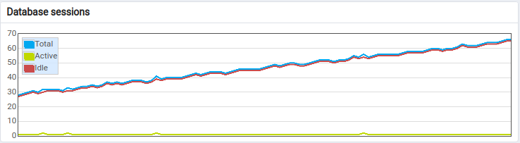

# dagster-testing

To reproduce the issue, open 4 terminal windows on the project root and run each of these commands in a different terminal:

```
make run_good
```

```
make monitor_good
```

```
make run_bad
```

```
make monitor_bad
```

Then open 2 browser tabs, one for the [working](http://localhost:9091/pipeline/bad_pipeline_parent/playground) and one for the [non-working](http://localhost:9092/pipeline/bad_pipeline_parent/playground) instances.

Launch the `bad_pipeline_parent` pipeline in both the working and non working. Switch to the monitor_good and monitor_bad tabs and watch how in the good one the postgres connection count is normal, while in the bad one there is a connection leak. About 10 mins after launch, the bad instance's pipeline's `bad_pipeline` children will start erroring out with a Postgres "too many clients" error, while the good instance's continues to work fine indefinitely.

This issue is easy to spot in pgAdmin:

X axis spans about 2 mins.

## Binary commit search

Good
0794c34855b484d7d5ff4747c5b19764352ed040 (0.8.6)
72f2e129f6f3999d6930b86a148a9b2b6b70dfa6 jul 7
485365dba8393597e678815e6597b4031b3722da jul 8
27f04dc875572e8af809d24343ebc613914e4507 jul 9


90d404169d60fea714bdcd09b827c6de74c8a261 jul 9


Bad
f711a5bce92f08c18f56fa20999366690c0b2788 jul 9
3f8e21850713062648e0d403b9a7fedb7aca2e93 jul 9
07f5cf80b224053afb8cbfbb6587da420dcc5dab (0.8.7)
